# 秒杀项目文档

## 一、项目背景

**就是一个商城秒杀系统。**

## 二、技术选型

前端：Vue

后端：SpringBoot + MybatisPlus + Lombok

中间件：RabbitMQ + Redis

主要就是一个前后端分离的小项目。

## 三、项目收获

1. 分布式会话
   - 用户登录
   - session共享
2. 功能开发
   - 商品列表展示
   - 商品详情展示
   - 秒杀
   - 订单详情
3. 系统压测
   - 使用JMeter进行压测
4. 安全优化
   - 隐藏秒杀地址
   - 验证码
   - 接口限流
5. 服务优化
   - RabbitMQ消息队列
   - 接口优化
   - 分布式锁
6. 页面优化
   - Redis缓存
   - 动静分离


## 四、项目实现

**注意：这里不再写出详细代码，具体代码可见github：**

秒杀系统设计的核心思想：

- 稳：保证系统的高可用，即使在大流量的情况下也能保证系统的运行。
- 准：要求在并发的场景下，不会出现超卖的情况。
- 块：用户下订单的请求速度块，增加用户体验。

### 4.1 项目搭建

主要配置如下：

- pom文件的依赖引入（详情查看pom文件）
- 配置文件配置相关信息：端口、数据源、连接池、mybatis-plus、日志等（详情查看application.yml配置文件）
- 在数据库中添加测试数据，并在测试包中添加MP的代码自动生成类，测试自动代码生成环境（详见test/CodeGenerator类）
- 加入Swagger配置类，配置swagger相关信息（详见utils/SwaggerConfig类）
- 加入统一返回结果（详情查看utils/Result类）
- 测试：启动项目，使用swagger查看并访问

### 4.2 登录功能实现

**3.2.1 数据库创建**

> 
>
> 数据库创建过程查看附件中的sql。
>
> **需要注意**：这里密码使用了二次加密，即：
>
> - 浏览器端先进性一次密码加密再传输给后台（防止网络传输途中被截获明文密码）
> - 后代再进行一次加密再保存到数据库（保证数据库泄漏也能保证密码安全）
>
> 但是为了方便，这里不再前端进行md5加密。

**3.2.2 MD5工具类引入**

> ````xml
>         <!--MD5依赖-->
>         <dependency>
>             <groupId>commons-codec</groupId>
>             <artifactId>commons-codec</artifactId>
>         </dependency>
>         <dependency>
>             <groupId>org.apache.commons</groupId>
>             <artifactId>commons-lang3</artifactId>
>         </dependency>
> ````
>
> 编写工具类对密码进行加密（详细代码可查看MD5Util类）
>
> ````java
> public static String md5(String pwd){
>     return DigestUtils.md5Hex(pwd);
> }
> ````

**3.2.3 使用代码生成工具生成数据库t_user表的相关代码**（详情查看CodeGenerator类）

> 注意：由于版本原因，实体类中的逻辑删除字段需要手动添加@TableField(value = "is_deleted")

**3.2.4 登录实现**

> 后端：
>
> 1. 在UserController类中添加登录方法
> 2. 解决跨域问题：1.使用@CrossOrigin注解；2.使用配置类实现WebMvcConfigurer接口实现addCorsMappings方法（详见WebConfig类）3.使用CORSFilter 过滤器
> 3. 编写登录逻辑：
>    - Controller使用loginV接收用户提交的用户名信息；
>    - 调用serveice方法实现如下：
>      - 根据用户名称查询用户信息，并判断结果是否为空；
>      - 将用户密码加密与查询出来的密码比较是否一样；
>      - 根据结果返回
>    - Controller接收Service返回的对象，判断是否为空：空返回登录失败，否则成功。

**问题1：当要在Cookie中设置token时，由于浏览器设定和跨域问题，导致set-cookie失败，后面的请求中将无法携带cookie，如何解决？**

1. 问题发现：

   - 业务逻辑：用户登录成功之后会生成UUID为Session的key；添加Cookie："token"：UUID；当用户再次访问的时候需要获取token再获取session中的信息。但是当再次访问的时候不会携带token，只携带JsessionID。

2. 判断出问题地方：

   - 在登录后的响应体中看到set-cookie:token  所以后端没为题；
   - 在第二次访问的时候后端无法获取cookie，请求体中也没有发现token，所以问题出在set-token上——即浏览器设置cookie失败
   
3. 解决：经查阅资料发现是由于chrom浏览器开启了SameSite用于防止CSRF（跨域请求伪造），当关闭该选项之后即可。设置方式：

   - 地址栏输入：chrome://flags/

   - 搜索栏输入SameSite，得到如下：

     

   - 改为disable，并重启浏览器即可

**问题2：Cookie的path问题**

后端返回给前端Cookie之后默认设置的path为url的上一级，如：

- /user/login返回的set-cookie的path为/user
- 但是这导致了访问/goods/**的url是无法携带该cookie，因为只有在匹配/user/*的url才能携带cookie。（关于cokie的path自行百度）

解决办法：后端在返回cookie的时候设置cookie的path为统一的值，这样就可以避免这个问题。

```java
cookie.setPath("/spike_system");
```

### 4.3 共享session

> 使用Spring-session将共享session存储在redis中。整个使用过程中使无侵入的。
>
> - 导入redis依赖
> - 导入SpringSession依赖（详见pom文件）
> - 配置redis连接信息（详情查看Application配置文件）
> - 创建Redis配置类，用于序列化对象存到Redis中；这里使为了后面使用所以先配置，以后直接注入Redistemplate即可使用（详见RedisConfig类）
> - 配置完启动项目即可。可以通过redis客户端查看redis中的session数据

### 4.4 一般商品展示

> 1.表设计：（详情查看spike.sql文件）
>
> - spike_system_goods：商品表
> - spike_system_order：订单表
> - spike_system_skgoods：秒杀商品表
> - spike_system_skorder：秒杀订单表

> 2.代码生成：
>
> 使用MP的代码生成器生成相关的类。

> 3.编写Controller：
>
> 1. 在GoodsController中编写查询分页商品的信息；
> 2. 配置MP的分页组件（详见MybatisPlusConfig配置类）
> 3. 编写查询逻辑：
>    - handler获取查询的页、页大小的信息
>    - 调用GoodsService中的方法进行分页查询
>    - 将结果返回该handler
>    - 返回结果给前端。

### 4.5 秒杀商品展示

> 1.数据：
>
> 使用新建的VO存储秒杀商品的信息（根据表设计，需要将秒杀商品与一般商品连接查询，所以创建新的VO存储数据发送给前端）（详见SkGoodsVo实体类）
>
> 2.数据库查询
>
> 使用mapper.xml来编写sql语句进行负载查询。（详见SkgoodsMapper.xml）
>
> 3.流程：
>
> 1. SkgoodsController接收前端发送的请求，根据token判断是否具有权限访问
> 2. 调用service --> mapper 进行查询并返回结果。

### 4.6 一般商品购买

> 1. Controller层：（详情查看OrderController类）
>
>    - 接口接收数据：
>
>      1.商品id：用于获得商品信息
>
>      2.User：该参数是自定义参数，有拦截器拦截请求后传入；用于判断用户是否登录并获得用户的信息，详情过程可查看WebConfig类中的addArgumentResolvers方法
>
>    - 根据User参数判断是否登录；
>
>    - 使用商品id参数查询商品信息，判断库存是否足够；
>
>    - 调用service方法添加订单，修改商品库存
>
>    - 返回结果
>
> 2. Service层：（详情查看OrderServiceImpl类）
>
>    - 根据信息创建订单；
>    - 调用GoodsMapper修改商品库存；
>    - 返回结果

### 4.7 秒杀商品购买

> 1. Controller层：（详情查看SkorderController类）
>    - 接口参数：商品id、User对象（同3.6）
>    - 根据User判断是否登录
>    - 判断秒杀商品库存
>    - 调用service创建订单和添加数据
>    - 返回结果
> 2. Service层：（详情查看SkorderServiceImpl类）
>    - 首先判断当前用户是否已经抢购过该商品，是则返回提示信息不能多次购买
>    - 创建商品订单（商品信息）
>    - 创建秒杀订单（秒杀信息，外键管理商品订单）
>    - 返回结果

## 五、秒杀压力测试

压力测试使用软件：Jmeter

QPS（每秒查询率）：QPS是对一个特定的查询服务器在规定时间内所处理流量多少的衡量标准

TPS（每秒传输的事物处理个数）：服务器每秒处理的事务数

### 5.1 Jmeter使用

下载：[Jmeter下载地址](https://jmeter.apache.org/download_jmeter.cgi)，下载解压之后点击bin/jmeter.bat即可启动。

使用步骤：

1. 创建线程组

   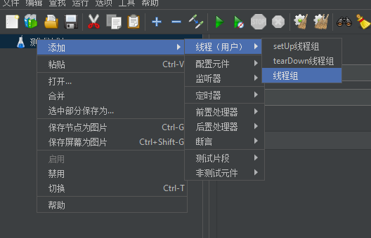

2. 设置线程参数

   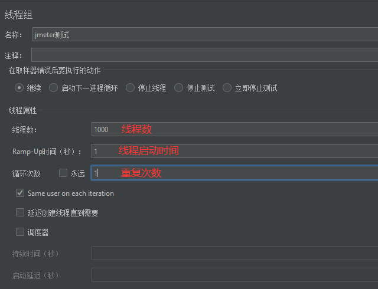

3. 添加请求默认值

   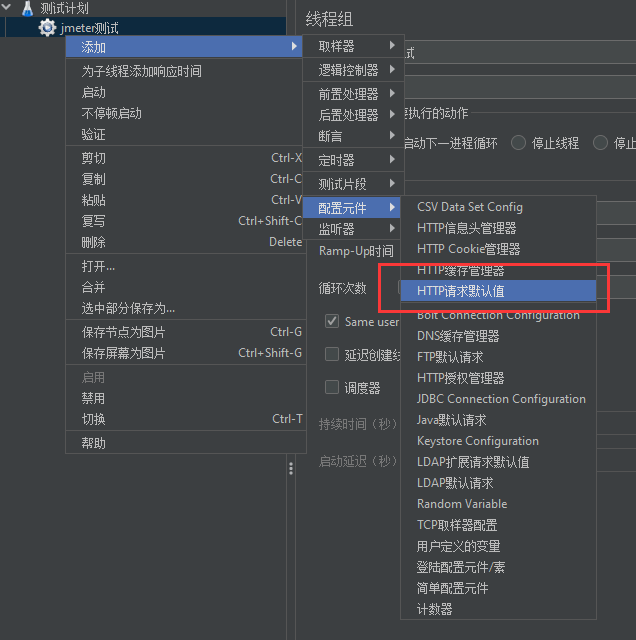

4. 设置默认值的源信息

   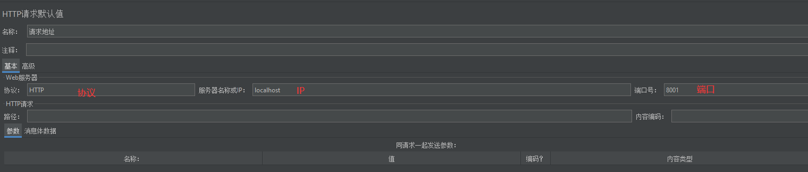

5. 添加请求

   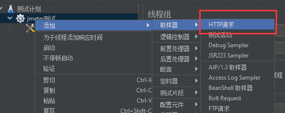

6. 设置请求url

   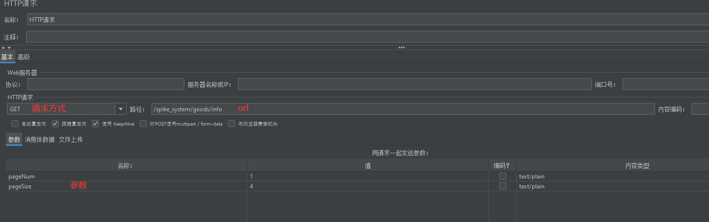

7. 添加结果显示，可添加多个

   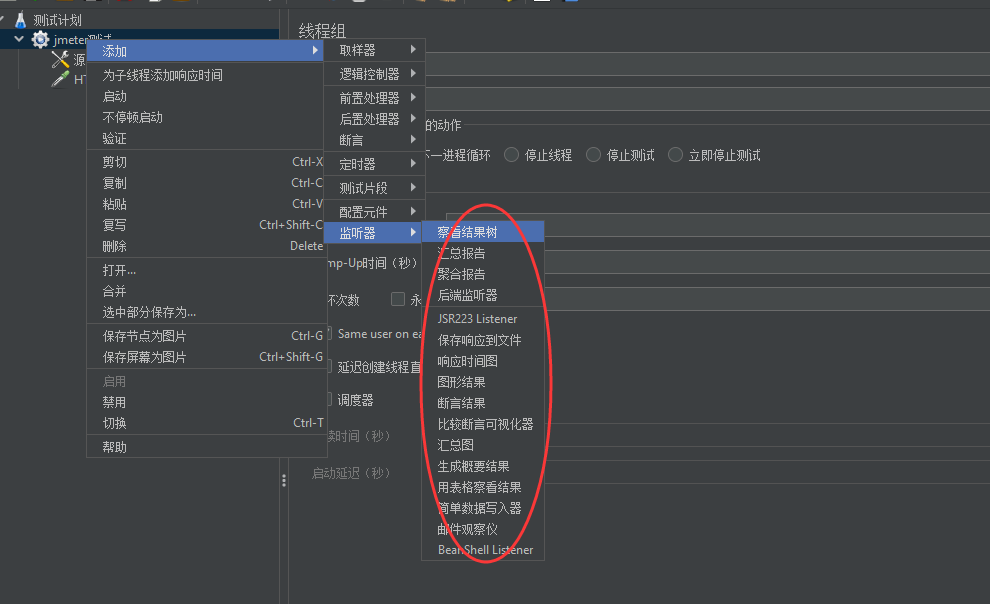

8. 执行测试

   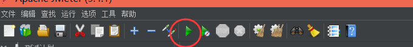

9. 查看结果

   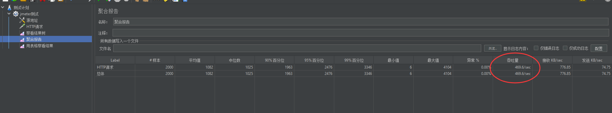


### 5.2 Linux环境测试

**第一步：准备Linux环境**

- 将程序打包部署在Linux中（需要JDK环境）
- 在Linux系统中准备数据库，并将数据准备好
- 下载Linux环境的Jmeter并解压

**第二部：测试Jmeter是否可用**

- 进入Jmeter/bin，打开jmeter.properties文件，修改sampleresult的字符集为UTF-8

- 在windows下的Jmeter中保存.jmx测试脚本

  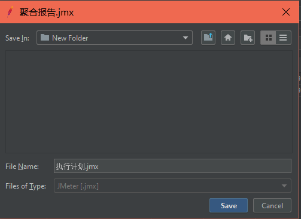

- 将该.jmx文件上传至Linux中

- 启动Jmeter，并选定该执行计划

  ````shell
  # -n 以非gui运行
  # -t 选择执行的jmx文件
  # -l 输出结果
  ./jmeter.sh -n -t ./jmx/xxxx.jmx -l ./jtl/result.jtl
  ````

- 将输出文件导出到windows中，使用jmeterGUI查看（只能使用聚合结果查看）

  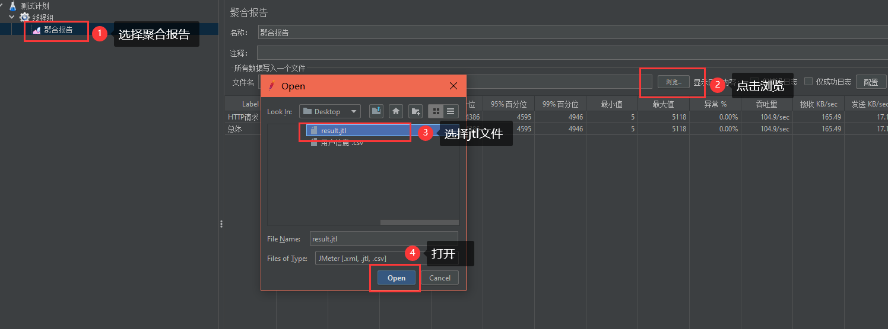


### 5.3 不同用户测试

1. 准备不同用户的登录的Cookie，并保存到自定义文件中。如下：`用户名,Cookie`

   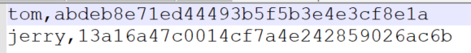

2. 在Jmeter中读取该文件，并设置变量名称

   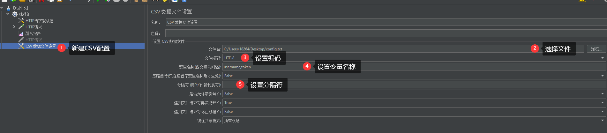

3. 设置Cookie管理器，设置Cookie

   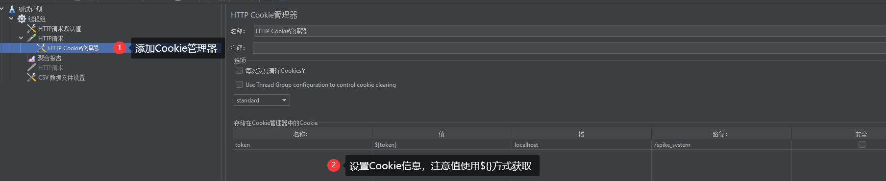

4. 测试


### 5.4 正式测试

一、商品列表接口测试（吞吐量/sec）：

|        | Windows（CPU:4%;内存：70%）5000*10 | Linux（2000*10） |
| :----: | :--------------------------------: | :--------------: |
| 第一次 |               630.9                |      425.8       |
| 第二次 |               674.9                |      355.2       |
| 第三次 |               673.6                |      328.8       |
|  平均  |               659.8                |      370.5       |

二、秒杀接口测试（吞吐量/esc）：

由于该功能需要登录，所以需要先准备好用户数据并登录（获取token），因此需要实现准备好。这里使用一个工具类来实现，类中实现：（详见utils包下的UserManager类）

- 创建指定数量用户并保存到数据库；

- 对每一个用户访问登录接口，并获得各自的token和SESSION；

- 将每token保存到一个文件交给Jmeter使用。（使用5.3方式测试）

  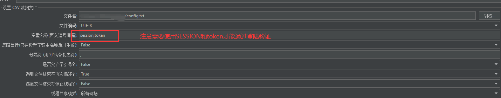


|        | Windows（CPU:10%;内存：73%）1000*10 | Linux（1000*10） |
| :----: | :---------------------------------: | :--------------: |
| 第一次 |                299.7                |      110.6       |
| 第二次 |                339.7                |       78.0       |
| 第三次 |                335.1                |       90.4       |
|  平均  |                                     |                  |

`秒杀存在问题：`

1. 效率变得很低；
2. 在数据库中会出现订单超过库存的情况
3. 超卖（暂时没有）


## 六、优化

### 6.1 前端优化

前端优化并不能提高秒杀业务的效率，但是可以很好的减轻服务器的压力，也可以提升用户的体验，更快的拿到数据。

**6.1.1 缓存**

> **在缓存中主要有三种**：
>
> 1. 页面缓存：即将整个渲染好的页面放到缓存中，读取时直接从缓存中读取渲染好的页面返回给浏览器，否则从数据库中读取数据再手动渲染并返回。**该方式粒度大，需要设置缓存更新（过期）时间防止用户看到的是过期的数据，适用于不经常变化的页面展示**。
> 2. URL缓存：**与页面缓存相似**，区别在于对URL路径进行了细分。比如针对于某一个商品ID的URL进行单独的页面缓存——"/get/info/{goodsid}"，当goodsid变化不同时会缓存不同的页面。
> 3. 对象缓存：**该方式粒度最细**，用于缓存对象数据，根据一个key直接从缓存中获取一个对象。比如存储登录用户信息的对象，只要用户不修改信息该对象就可以一致存在缓存中；但是当修改用户信息的时候就需要注意：先更新数据库，再更新缓存，否则会出现数据不一致的问题。
>
> 更多关于缓存的问题推荐阅读：[一文带你搞懂“缓存策略”](https://juejin.cn/post/6844903961078530062)、[缓存那些事](https://tech.meituan.com/2017/03/17/cache-about.html)
>
> 
>
> 例如：在该项目中对于秒杀商品进行了缓存处理，业务逻辑如下：（详见SkgoodsController类）
>
> - 用户请求访问商品列表接口；
> - 首先查询Redis缓存中是否有相关数据，有则直接返回，没有则下一步；
> - 查询数据库，并将查询到的数据放入缓存中，将结果返回给用户；
> - 由于上一步已经把数据放到Redis中，所以其他用户再访问的时候可以直接从缓存中获取数据；
>
> 通过压测测试表明：使用缓存时的QPS是不使用缓存情况下的2~3倍。

**6.1.2 页面静态化**

> 即前端只是静态页面（html），不需要服务端进行页面渲染之后再返回。前端页面通过js来动态渲染，使用Ajax来获取数据。这样在网络传输时候只需要传输对应的数据即可，不需要在传输整个页面。并且浏览器可以把数据缓存在客户端。
>
> 可以在Springboot配置文件中进行对应的配置：对静态资源进行缓存处理之后，浏览器多次向服务完全请求时会传输 If-Modified-Since 头，如果资源没有变化就返回304，直接使用缓存中的数据。

**6.1.3 静态资源优化**

**6.1.4 CDN优化**


