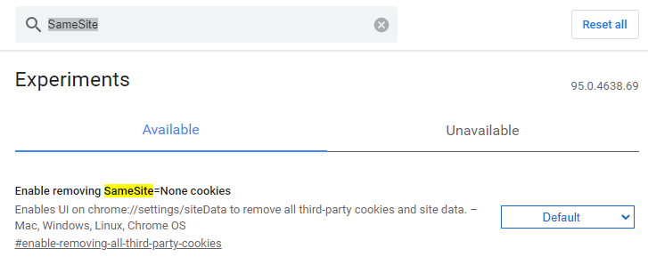

# 秒杀项目文档

## 一、项目背景

**就是一个商城秒杀系统。**

## 二、技术选型

前端：Vue

后端：SpringBoot + MybatisPlus + Lombok

中间件：RabbitMQ + Redis

主要就是一个前后端分离的小项目。

## 三、项目收获

1. 分布式会话
   - 用户登录
   - session共享
2. 功能开发
   - 商品列表展示
   - 商品详情展示
   - 秒杀
   - 订单详情
3. 系统压测
   - 使用JMeter进行压测
4. 安全优化
   - 隐藏秒杀地址
   - 验证码
   - 接口限流
5. 服务优化
   - RabbitMQ消息队列
   - 接口优化
   - 分布式锁
6. 页面优化
   - Redis缓存
   - 动静分离


## 四、项目实现

**注意：这里不再写出详细代码，具体代码可见github：**

秒杀系统设计的核心思想：

- 稳：保证系统的高可用，即使在大流量的情况下也能保证系统的运行。
- 准：要求在并发的场景下，不会出现超卖的情况。
- 块：用户下订单的请求速度块，增加用户体验。

### 3.1 项目搭建

主要配置如下：

- pom文件的依赖引入（详情查看pom文件）
- 配置文件配置相关信息：端口、数据源、连接池、mybatis-plus、日志等（详情查看application.yml配置文件）
- 在数据库中添加测试数据，并在测试包中添加MP的代码自动生成类，测试自动代码生成环境（详见test/CodeGenerator类）
- 加入Swagger配置类，配置swagger相关信息（详见utils/SwaggerConfig类）
- 加入统一返回结果（详情查看utils/Result类）
- 测试：启动项目，使用swagger查看并访问

### 3.2 登录功能实现

**3.2.1 数据库创建**

> 
>
> 数据库创建过程查看附件中的sql。
>
> **需要注意**：这里密码使用了二次加密，即：
>
> - 浏览器端先进性一次密码加密再传输给后台（防止网络传输途中被截获明文密码）
> - 后代再进行一次加密再保存到数据库（保证数据库泄漏也能保证密码安全）
>
> 但是为了方便，这里不再前端进行md5加密。

**3.2.2 MD5工具类引入**

> ````xml
>         <!--MD5依赖-->
>         <dependency>
>             <groupId>commons-codec</groupId>
>             <artifactId>commons-codec</artifactId>
>         </dependency>
>         <dependency>
>             <groupId>org.apache.commons</groupId>
>             <artifactId>commons-lang3</artifactId>
>         </dependency>
> ````
>
> 编写工具类对密码进行加密（详细代码可查看MD5Util类）
>
> ````java
> public static String md5(String pwd){
>     return DigestUtils.md5Hex(pwd);
> }
> ````

**3.2.3 使用代码生成工具生成数据库t_user表的相关代码**（详情查看CodeGenerator类）

> 注意：由于版本原因，实体类中的逻辑删除字段需要手动添加@TableField(value = "is_deleted")

**3.2.4 登录实现**

> 后端：
>
> 1. 在UserController类中添加登录方法
> 2. 解决跨域问题：1.使用@CrossOrigin注解；2.使用配置类实现WebMvcConfigurer接口实现addCorsMappings方法（详见WebConfig类）3.使用CORSFilter 过滤器
> 3. 编写登录逻辑：
>    - Controller使用loginV接收用户提交的用户名信息；
>    - 调用serveice方法实现如下：
>      - 根据用户名称查询用户信息，并判断结果是否为空；
>      - 将用户密码加密与查询出来的密码比较是否一样；
>      - 根据结果返回
>    - Controller接收Service返回的对象，判断是否为空：空返回登录失败，否则成功。

**问题1：当要在Cookie中设置token时，由于浏览器设定和跨域问题，导致set-cookie失败，后面的请求中将无法携带cookie，如何解决？**

1. 问题发现：

   - 业务逻辑：用户登录成功之后会生成UUID为Session的key；添加Cookie："token"：UUID；当用户再次访问的时候需要获取token再获取session中的信息。但是当再次访问的时候不会携带token，只携带JsessionID。

2. 判断出问题地方：

   - 在登录后的响应体中看到set-cookie:token  所以后端没为题；
   - 在第二次访问的时候后端无法获取cookie，请求体中也没有发现token，所以问题出在set-token上——即浏览器设置cookie失败
   
3. 解决：经查阅资料发现是由于chrom浏览器开启了SameSite用于防止CSRF（跨域请求伪造），当关闭该选项之后即可。设置方式：

   - 地址栏输入：chrome://flags/

   - 搜索栏输入SameSite，得到如下：

     

   - 改为disable，并重启浏览器即可

**问题2：Cookie的path问题**

后端返回给前端Cookie之后默认设置的path为url的上一级，如：

- /user/login返回的set-cookie的path为/user
- 但是这导致了访问/goods/**的url是无法携带该cookie，因为只有在匹配/user/*的url才能携带cookie。（关于cokie的path自行百度）

解决办法：后端在返回cookie的时候设置cookie的path为统一的值，这样就可以避免这个问题。

```java
cookie.setPath("/spike_system");
```

### 3.3 共享session

> 使用Spring-session将共享session存储在redis中。整个使用过程中使无侵入的。
>
> - 导入redis依赖
> - 导入SpringSession依赖（详见pom文件）
> - 配置redis连接信息（详情查看Application配置文件）
> - 创建Redis配置类，用于序列化对象存到Redis中；这里使为了后面使用所以先配置，以后直接注入Redistemplate即可使用（详见RedisConfig类）
> - 配置完启动项目即可。可以通过redis客户端查看redis中的session数据

### 3.4 一般商品

> 1.表设计：（详情查看spike.sql文件）
>
> - spike_system_goods：商品表
> - spike_system_order：订单表
> - spike_system_skgoods：秒杀商品表
> - spike_system_skorder：秒杀订单表

> 2.代码生成：
>
> 使用MP的代码生成器生成相关的类。

> 3.编写Controller：
>
> 1. 在GoodsController中编写查询分页商品的信息；
> 2. 配置MP的分页组件（详见MybatisPlusConfig配置类）
> 3. 编写查询逻辑：
>    - handler获取查询的页、页大小的信息
>    - 调用GoodsService中的方法进行分页查询
>    - 将结果返回该handler
>    - 返回结果给前端。
>

### 3.5 秒杀商品

> 1.数据：
>
> 使用新建的VO存储秒杀商品的信息（根据表设计，需要将秒杀商品与一般商品连接查询，所以创建新的VO存储数据发送给前端）（详见SkGoodsVo实体类）
>
> 2.数据库查询
>
> 使用mapper.xml来编写sql语句进行负载查询。（详见SkgoodsMapper.xml）
>
> 3.流程：
>
> 1. SkgoodsController接收前端发送的请求，根据token判断是否具有权限访问
> 2. 调用service --> mapper 进行查询并返回结果。

